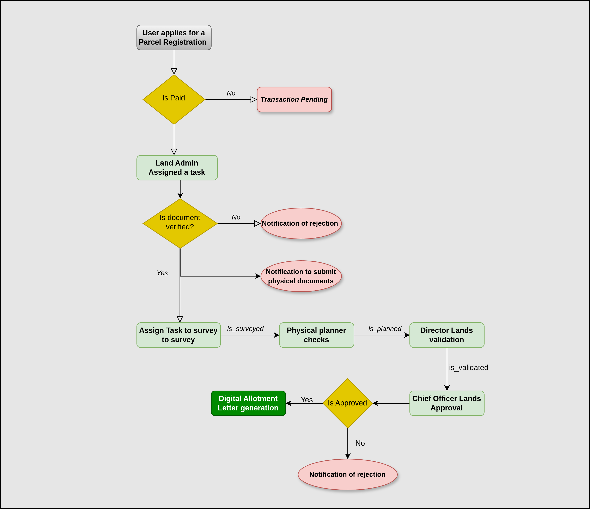

# County LIMS System

The **County Land Information Management System (LIMS)** for Wajir County provides a structured way to handle and process various land-related services. This system uses transaction codes that are constructed from modules, services, and other attributes.

This README provides information on the structure of the system, how the transaction codes are generated, and the different modules and services available in the system.

---

## Table of Contents

- [Introduction](#introduction)
- [Modules and Service Prefixes](#modules-and-service-prefixes)
  - [County Modules](#county-modules)
  - [SubBusiness Process](#subbusiness-process)
  - [Process Prefixes](#process-prefixes)
  - [Work Flows](#work-flows)
    - [Parcel Registration](#parcel-registration)
- [Transaction Code Format](#transaction-code-format)
- [Code Example](#code-example)
- [Transaction Code Example](#transaction-code-example)
- [Finance Bill Fee Implementation](#finance-bill-fee-implementation)

---

## Introduction

The County LIMS system is designed to help manage land-related processes in Wajir County. The system organizes these processes into different **modules** and **services**. For each operation, a **transaction code** is generated to uniquely identify the process.

### Key Components
1. **Modules**: These represent the various aspects of land administration in the county.
2. **Services**: These represent different sub-business processes related to land management.
3. **Transaction Code**: A unique identifier for each transaction that includes details about the module, service, and the specific operation.

---

## Modules and Service Prefixes

The system uses prefixes to identify different **modules** and **services**. The prefixes are defined in dictionaries that map service names to their corresponding codes and abbreviations.

### County Modules

The **County Modules** represent different functional areas in the land administration process. Each module has a corresponding **prefix**:

```python
COUNTY_MODULE_PREFIXES = {
    "LAND_ADMINISTRATION": "LA",
    "PHYSICAL_PLANNING": "PP",
    "SURVEY_AND_MAPPING": "SM",
    "LAND_RATES_LAND_RENT": "LRR",
}
```

These are the available modules in the system:

- Land Administration: LA
- Physical Planning: PP
- Survey and Mapping: SM
- Land Rates & Rent: LRR

## SubBusiness Process

The **SubBusiness** process classifies the various services offered within the system. Each service has a corresponding code and prefix:

These are the available services:
- Parcel Registration: PR
- Land Transfer: LT
- Land Search: LS
- Land Encumbrance: LE
- Subdivision: SD
- Amalgamation: AG
- Change of Use: CU
- Extension of Use: EU
- Renewal of Lease: RL
- Extension of Lease: EL
- Application for Lease: AL
- Application for PDP: AP
- Development Control: DC
- Plot Verification & Establishment: PVE
- New Grants: NG
- Beacon and Boundary Re-establishment: BBR
- Re-surveys: RS
- Roads Access: RA
- Land Rates: LRA
- Land Rent: LRE

## Process Prefixes

```python
PROCESS_PREFIXES = {
    "PARCEL_REGISTRATION": {"CODE": 1, "PREFIX": "PR"},
    "LAND_TRANSFER": {"CODE": 2, "PREFIX": "LT"},
    "LAND_SEARCH": {"CODE": 3, "PREFIX": "LS"},
    "LAND_ENCUMBRANCE": {"CODE": 4, "PREFIX": "LE"},
    "SUBDIVISION": {"CODE": 5, "PREFIX": "SD"},
    "AMALGAMATION": {"CODE": 6, "PREFIX": "AG"},
    "CHANGE_OF_USE": {"CODE": 7, "PREFIX": "CU"},
    "EXTENSION_OF_USE": {"CODE": 8, "PREFIX": "EU"},
    "RENEWAL_OF_LEASE": {"CODE": 9, "PREFIX": "RL"},
    "EXTENSION_OF_LEASE": {"CODE": 10, "PREFIX": "EL"},
    "APPLICATION_FOR_LEASE": {"CODE": 11, "PREFIX": "AL"},
    "APPLICATION_FOR_PDP": {"CODE": 12, "PREFIX": "AP"},
    "DEVELOPMENT_CONTROL": {"CODE": 13, "PREFIX": "DC"},
    "PLOT_VERIFICATION_ESTABLISHMENT": {"CODE": 14, "PREFIX": "PVE"},
    "NEW_GRANTS": {"CODE": 15, "PREFIX": "NG"},
    "BEACON_BOUNDARY_REESTABLISHMENT": {"CODE": 16, "PREFIX": "BBR"},
    "RE_SURVEYS": {"CODE": 17, "PREFIX": "RS"},
    "ROADS_ACCESS": {"CODE": 18, "PREFIX": "RA"},
    "LAND_RATES": {"CODE": 19, "PREFIX": "LRA"},
    "LAND_RENT": {"CODE": 20, "PREFIX": "LRE"},
}

```
## Work Flows
### Parcel Registration
Here is the workflow diagram for parcel registration


## Transaction Code Format

The transaction code is generated by combining several elements:

- County Module Prefix: Identifies the module.
- SubBusiness Process Prefix: Identifies the service.
- SubBusiness Process Code: Numeric code for the service.
- Date: The date of the transaction (in YYYYMMDD format).
- Incremental Count: A counter for transactions on that day.

#### Suggested Format:

The suggested transaction code format is:

```python
    Wajir/{module_prefix}/{service_prefix}/{service_code}/{date}/{count_today}
```
Where:

    module_prefix: The prefix for the selected module.
    service_prefix: The prefix for the selected service.
    service_code: The numeric code for the service.
    date: The current date in YYYYMMDD format.
    count_today: An incremental integer representing the count of transactions for the day (e.g., 1 for the first transaction).


## Example Output:

For Land Administration and Parcel Registration on 2025-02-16 with an incremental count of 1, the generated transaction code will be:

```
Wajir/LA/PR/1/20250216/1

```

## Finance Bill Fee Implementation

The implementation of this is in reference to the Wajir County Finance Bill 2024 which clearly stipulates the 
tax,fees, charges and other receipts payable and any other applicable rates.

### Fields

#### 1. `sub_business_process`
- **Type**: `CharField`
- **Choices**: `SubBusinessProcess.choices`
- **Description**: This field stores the specific sub-business process related to the fee. The value of this field will reflect the process under which the fee is categorized. Example: `'PARCEL_REGISTRATION'`, `'RATE_PAYMENT'`, etc.

#### 2. `type`
- **Type**: `CharField`
- **Choices**: `PaymentRateTypeChoices.choices`
- **Max Length**: `100`
- **Default**: `PaymentRateTypeChoices.FIXED_RATE`
- **Description**: This field determines the type of payment rate for the fee. It can represent either a fixed rate or a variable rate, depending on the specified choices in `PaymentRateTypeChoices`. The default is set to `FIXED_RATE`.

#### 3. `amount`
- **Type**: `FloatField`
- **Default**: `0`
- **Description**: The amount charged for the service or fee. It holds the numerical value for the fee, and defaults to 0 if no value is specified. This is a floating-point field to allow flexibility in representing different fee amounts.

#### 4. `service`
- **Type**: `IntegerField`
- **Choices**: `ServiceFeeChoices.choices`
- **Default**: `ServiceFeeChoices.RATES_CLEARANCE_CERTIFICATE or 19`
- **Description**: This field captures the type of service the fee is related to. Examples might include clearance certificates, rate payments, etc. The default service is set to `RATES_CLEARANCE_CERTIFICATE`.

### Use Case

The `FinanceBillFee` model is used to store dynamic fee structures related to various financial services provided by the county. These fees need to be flexible and updated regularly to reflect changes in the county’s finance policies. The model is designed for use by finance officers or other authorized personnel in the revenue department.

### Example Data

Below is an example of how you would define the data when adding a finance bill fee to the database:

```python
data = {
    'sub_business_process': 'PARCEL_REGISTRATION',
    'type': 'FIXED_RATE',
    'amount': 1500.0,
    'service': 'RATES_CLEARANCE_CERTIFICATE',
}
```


This represents a fee related to the 'Parcel Registration' sub-business process, with a fixed rate of 1500.0 for the service of issuing a rates clearance certificate.
### Role Access
This model is meant to be handled by a user with a designated role, such as a ```FINANCE_OFFICER```. The finance officer will be responsible for adding, updating, or deleting finance bill fees based on the Wajir County Finance Bill stipulations.
### Notes
- The model provides a flexible structure to accommodate different types of fees across various processes.
- It supports dynamic updates to the county's financial systems based on policy changes, ensuring the system remains up-to-date with the latest fee structures.
- Appropriate roles with the correct permissions should manage this model, ensuring financial integrity and compliance with the Wajir County Finance Bill.

